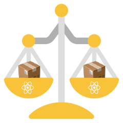

<p align="center">
  
</p>

<h3 align="center">
  React Native Bundle Scale
</h3>

<p align="center">
  A command-line interface to see how adding packages affects your React Native JavaScript bundle.
</p>

<p align="center">
  <a href="https://www.npmjs.org/package/react-native-bundle-scale">
    
  </a>
  <a href="https://www.npmjs.org/package/react-native-bundle-scale">
    
  </a>
  <a href="https://circleci.com/gh/charpeni/react-native-bundle-scale">
    
  </a>
  <a href="https://circleci.com/gh/charpeni/react-native-bundle-scale">
    
  </a>
  <a href="https://github.com/charpeni/react-native-bundle-scale/blob/master/LICENSE">
    
  </a>
</p>

<hr />

## Usage

You can use this CLI to either get the cost of adding packages to a freshly initialized React Native project or based on a `package.json`:

```sh
# To get the cost of adding `react-native-url-polyfill` to a freshly initialized React Native project
npx react-native-bundle-scale react-native-url-polyfill

# To get the cost of adding `react-native-url-polyfill` based on the current `package.json`
npx react-native-bundle-scale react-native-url-polyfill --package-json
```

The CLI will initialize a new React Native project either untouched or with the dependencies from the `package.json` you provided. It will generate a bundle for the original state, add the packages you provided, generate another bundle, and finally, diff both bundle sizes.

## What's the difference between this and Bundlephobia and co?

Don't get me wrong, Bundlephobia and co. are amazing tools. They will analyze a dependency and its transitive dependencies and will try to determine the cost associated with adding it.

Unfortunately, they aren't always accurate for React Native bundles. They are multiple reasons for that, but the main reasons are that React Native bundles all share the same initial dependencies, so it depends on what React Native packages by default, but it also depends on your current dependencies and their versions.

In this CLI case, it creates a React Native bundle with the provided packages and then diffs the size of both packages (with/without).

## License

react-native-bundle-scale is [MIT licensed](LICENSE).
